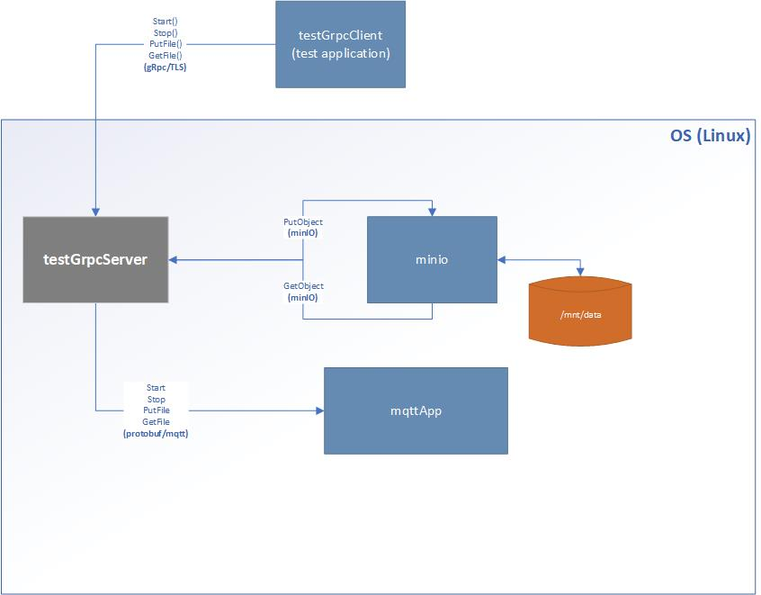

# gRPC testing app
This PoC contains 3 applications:
* testGrpcServer: a gRPC server implementing the service described by the grpcserver.proto file; it also sends mqtt notifications upon successful completion of the service request
* testGrpcClient: implements a gRPC client interface for the above mentioned server (grpcservice.proto)
* mqttApp: inplements a mqtt client that consumes the messages received from the gRPC server application
These applications can be deployed as microservices.



Below are the instructions on how to build and run the tests.
## building the test (container based)
Run the following command
```
    docker-compose build
```
## Running the tests (microservices)
Use the following command
```
    docker-compose up
```
This will take care, also of creating and launching the mqtt broker container
Pre-requisite:
A network called "docker-edge-broker_net" must first be created (in case you run the test for the first time) with the following command
```
    docker network inspect "docker-edge-broker_net" >/dev/null 2>&1 || docker network create --driver bridge "docker-edge-broker_net"
```
## dependencies
The project requires docker and docker-compose (v3.0) to be installed on your OS (Linux) distribution